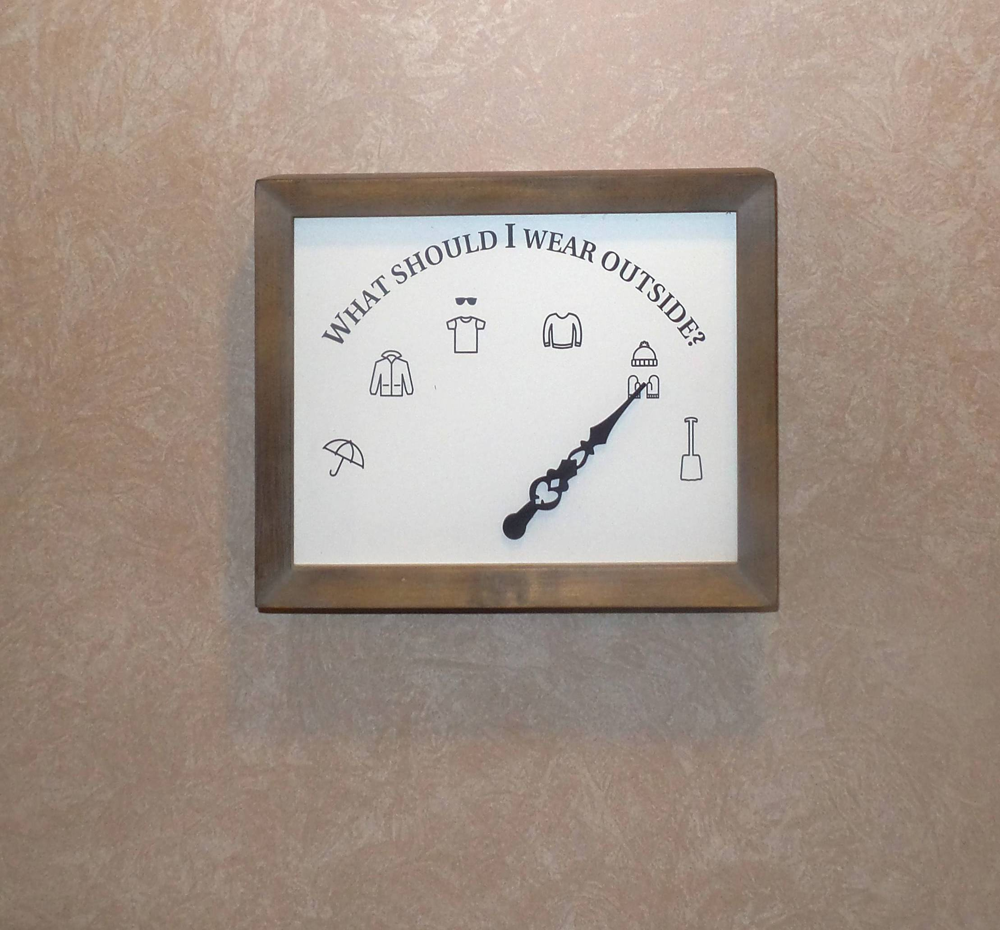

# What should I wear outside
## A hardware hack by Julien Vanier

[][1]

### [See the full project walk-through on Hackster.io][1]

## Deployment

```
git remote add dokku dokku@what-to-wear.dyndns.org
git push dokku master
```

Configuring domain
```
dokku domains:add what-to-wear what-to-wear.dyndns.org
```

[1]: https://www.hackster.io/monkbroc/what-should-i-wear-outside-81b6e4
